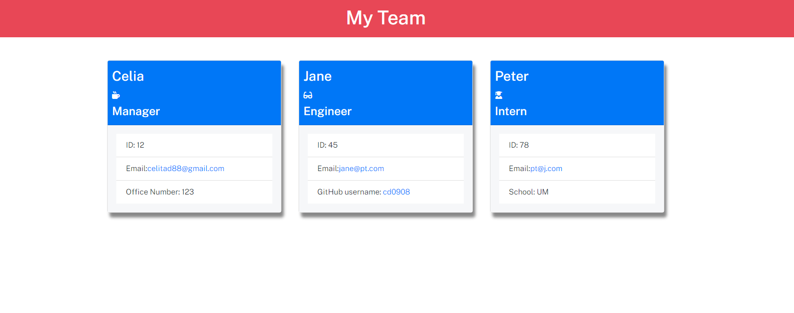

  # Team Profile Generator

  

  
  ## Description

    
  This application goal is to to build a Node.js command-line application that takes in information about employees on a software engineering team and generates an HTML webpage that displays summaries for each person.

  ## Table of Contents
  
  - [Installation](#installation)
  - [Usage](#usage)
  - [License](#license)
  - [Contributing](#contributing)
  - [Tests](#tests)
  - [Questions](#questions)
  

  ## Installation

  To install the neccesary dependencies, run the following command:

  npm i

  ## Usage

  To use the repo , see the following directions:

  1. Git clone the repo down to your local.
  2. Add a folder named dist to the root folder.
  3. Run npm install to install the  inquirer and jest packages that allows to prompt your inputs from the command line and run unit test respectively.
  4. Run node index.js to initialize the application.
  5. Answer the questions prompted in your command line.
  6. Finally, an HTML and CSS for styling the HTML, will be generated in the dist folder 

  
  

 

  Link to full video presentation: 

 https://drive.google.com/file/d/1MEesOXFReSDQVnhxb7Xw1z4TK4doVCOs/view 
    
  ## License

  
  This project is licensed under MIT license. 

  ## Contributing
  
  If you like to contribute to this application, please refer to the following guidelines:

  Please refer to the Contributor Covenant v2.1 in the following  website: https://www.contributor-covenant.org for guidelines details on how to contribute

  ## Tests

  To run tests,please run the following commands:
  
  -node index (to run the application)
  -npm run test (to run the tests used)

  ## Questions

  You can find me on Github: [cdona0908](https://github.com/cdona0908)  
  Any questions? Email me to : celiamdona@gmail.com
